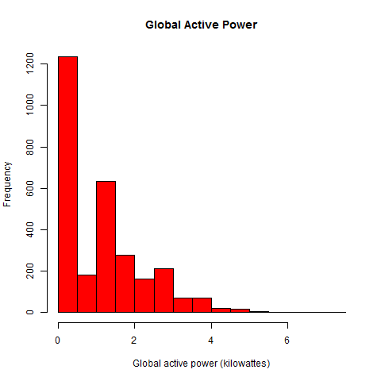
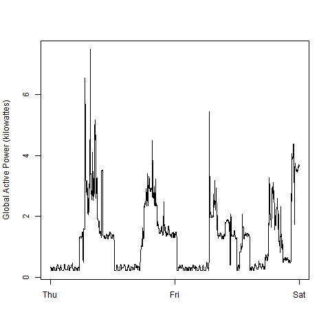
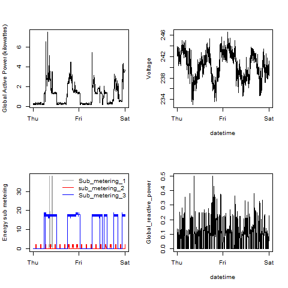

## Introduction

This is course project #1 for Exploratory Data Analysis (coursera). 
Short description on files:
* getDataFrame_household_power_consumption.R
check if file with data exists (household_power_consumption.txt actually)
if not, script downloads zip archive and unzip it;
then read data for 2007-02-01:2007-02-02 dates.
*plot1.R, plot2.R, plot3.R, plot4.R
uses previous script and draw a certain plot to a PNG file.

My plots:

### Plot 1

 

### Plot 2

 

### Plot 3

 

### Plot 4

 

